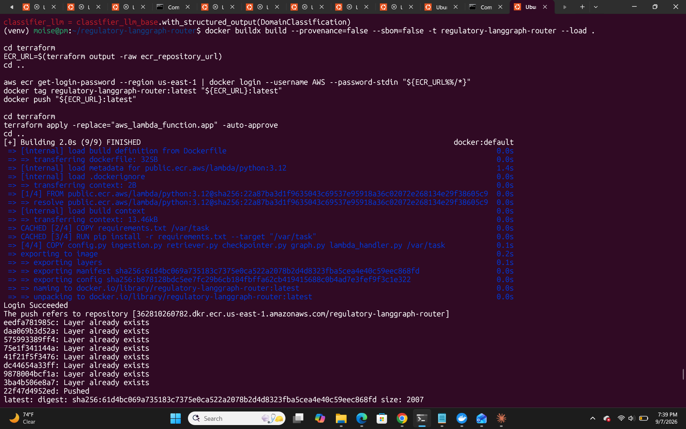
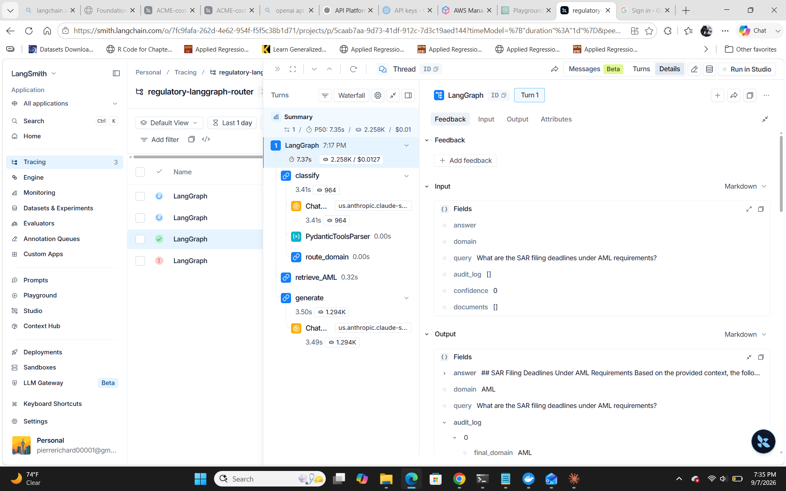
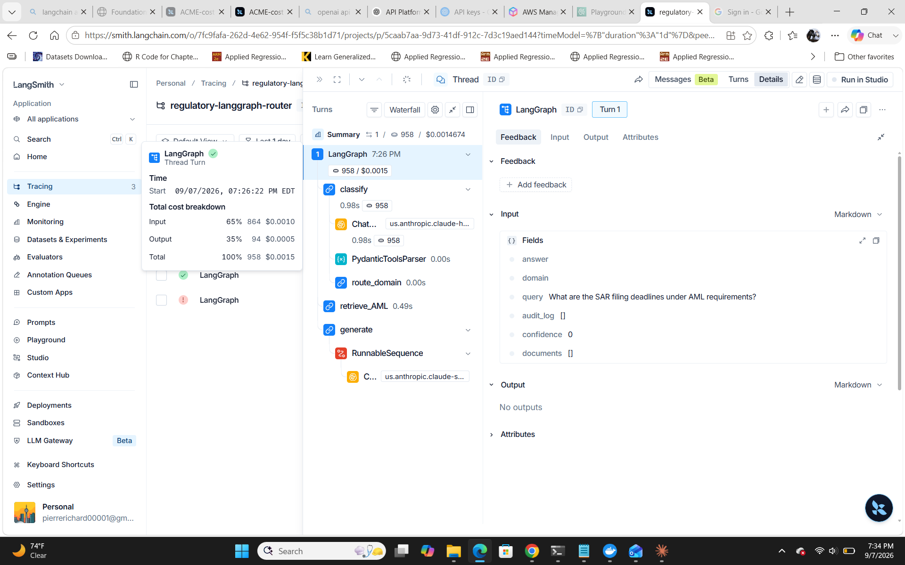
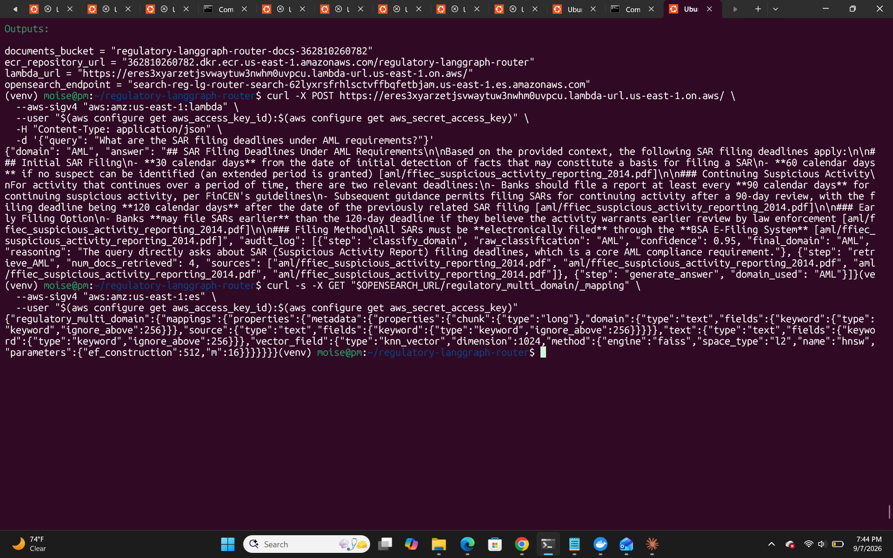

# Regulatory LangGraph Router

A domain-routed RAG system for regulatory Q&A (AML / BSA / OFAC / KYC), built on LangGraph and deployed end-to-end on AWS. A query is classified into a compliance domain, routed to a hybrid BM25+vector retriever scoped to that domain's real regulatory documents, and answered with citations by Claude — with full observability and a measured cost-per-query.

**Live proof, not just a diagram** — every claim below is backed by a real deployed run, screenshotted from LangSmith and the AWS CLI, not a local demo.

## Architecture

Query -> [Classify: Haiku 4.5] -> [Route by domain]
  - AML -> Hybrid Search (OpenSearch) -\
  - BSA -> Hybrid Search (OpenSearch)   \
  - OFAC -> Hybrid Search (OpenSearch)   -> [Generate: Sonnet 4.6] -> Cited Answer
  - KYC -> Hybrid Search (OpenSearch)   /
  - GENERAL -> Hybrid Search (OpenSearch) -/

- **Classifier**: Claude Haiku 4.5 via Bedrock, structured output picks one of five domains, with a confidence threshold that falls back to GENERAL rather than trusting a shaky call.
- **Retrieval**: OpenSearch native hybrid search (BM25 + k-NN via Faiss), domain-filtered, over real ingested regulatory PDFs (FFIEC, OCC, FinCEN).
- **Generation**: Claude Sonnet 4.6 via Bedrock, answers strictly from retrieved context with source citations.
- **Persistence**: DynamoDB-backed LangGraph checkpointing.
- **Deployment**: Lambda (container image) behind a SigV4-authenticated Function URL, all infra as Terraform.
- **Observability**: LangSmith tracing on every node.

## Tech stack

LangGraph, Amazon Bedrock (Claude Sonnet 4.6 + Haiku 4.5, Titan Embeddings), OpenSearch (Faiss k-NN), AWS Lambda, DynamoDB, S3, Terraform, Docker

## Proof it actually works

### 1. Real query, real answer, real citations

A live request to the deployed Lambda, answered entirely from an ingested FFIEC document:

Q: What are the SAR filing deadlines under AML requirements?
A: 30 calendar days from initial detection (60 if no suspect identified)... [aml/ffiec_suspicious_activity_reporting_2014.pdf]

Full request/response, terraform output showing live infra:

### 2. Cost optimization, measured before/after

The classifier only needs to pick 1 of 5 labels, running it on the same model as generation was wasted spend. Caught via a LangSmith trace showing the classifier step accounted for most of the cost, swapped Sonnet 4.6 to Haiku 4.5 for that node only.

| Stage | Model | Total cost/query |
|---|---|---|
| Before | Sonnet 4.6 classifier | $0.0127 |
| After | Haiku 4.5 classifier | $0.0015 |

About 8x cost reduction on the classification step, no change to answer quality (generation still uses Sonnet 4.6).

### 3. Real infrastructure bug, diagnosed and fixed

Domain-filtered hybrid search failed in production with "Engine [NMSLIB] does not support filters". Root cause: LangChain's OpenSearch integration defaults the k-NN index to the NMSLIB engine, which cannot filter at all, no query syntax works around it. Fix: re-index explicitly with engine="faiss", which supports filtered k-NN.

## Project structure

config.py - settings, model clients (Sonnet 4.6 + Haiku 4.5), IAM-based OpenSearch auth, SLO thresholds
guardrails.py - structured-output validation and retry/fallback for LLM calls in the graph
ingestion.py - standalone: loads PDFs from S3 per domain prefix, chunks, embeds, indexes (Faiss)
retriever.py - runtime: OpenSearch native hybrid (BM25+kNN) retrieval, domain-filtered
checkpointer.py - DynamoDB checkpoint persistence
graph.py - LangGraph: state, classify/retrieve/generate nodes, conditional routing
main.py - local CLI entry point
lambda_handler.py - AWS Lambda entry point (same graph)
online_eval_handler.py / slo_monitor_handler.py - scheduled Lambda entry points for the reliability layer below
Dockerfile - Lambda container image (all three entry points share one image)
deploy.sh - full deploy: infra, image, ingestion, one command
terraform/ - OpenSearch, Lambda, IAM, ECR, S3, DynamoDB, EventBridge schedules, all as code
evals/ - eval.py's LangSmith-integrated + online + SLO-monitoring counterparts (see AI Reliability Layer below)

## Running it

pip install -r requirements.txt
export OPENSEARCH_URL="https://your-domain.us-east-1.es.amazonaws.com"
export DOCUMENTS_BUCKET="your-s3-bucket"
python ingestion.py
python main.py

Full AWS deploy (provisions everything, OpenSearch, Lambda, S3, DynamoDB, ECR, IAM):

./deploy.sh

## What's not automated

- The OpenSearch domain takes several minutes to become active after provisioning.
- Bedrock model access for third-party models requires a one-time "use case" form submission per AWS account (not scriptable).
- Upload your own source PDFs to S3 under domain prefixes (aml/, bsa/, ofac/, kyc/, general/) before running ingestion.

## Evaluation

Built a RAGAS-based eval harness (`eval.py`, `eval_dataset.py`) against 10 golden questions across AML/BSA/KYC, run through the actual deployed graph — not a separate test-only path. Metrics: **Faithfulness** (is the answer supported by retrieved context), **Answer Relevancy**, **Context Precision**, and **Context Recall**.

### Baseline (k=4 retrieval)

| Metric | Score |
|---|---|
| Faithfulness | 0.889 |
| Answer Relevancy | 0.654 |
| Context Precision | 0.533 |
| Context Recall | 0.457 |

The aggregate hid the real story: 3 of 10 questions scored a hard 0.0 across relevancy/precision/recall. Rather than trust the average, each failure was traced to its retrieved context individually.

### Root-cause diagnosis

| Question | Root cause | Category |
|---|---|---|
| CIP requirements | No CIP document existed anywhere in the corpus (confirmed via filename search and full-text search of the adjacent CDD document) | Corpus gap |
| BSA recordkeeping ($10K CTR) | No document in the corpus covers CTR thresholds | Corpus gap |
| AML program elements | Right content existed but ranked below the top-k results | Retrieval precision |

### Tested fix #1: increase k (4 to 6) — reported honestly as a wash

| Metric | k=4 | k=6 | Delta |
|---|---|---|---|
| Faithfulness | 0.889 | 0.909 | +0.019 |
| Answer Relevancy | 0.654 | 0.612 | -0.042 |
| Context Precision | 0.533 | 0.505 | -0.029 |
| Context Recall | 0.457 | 0.580 | +0.123 |

Recall improved, but precision and relevancy both slipped — the classic recall/precision tradeoff. More candidates surfaced more relevant material overall, but also introduced noise into previously-clean answers. **Net effect: not a clear win.** Retrieval-tuning alone did not fix the CIP failure, confirming it was a corpus gap, not a ranking problem.

### Tested fix #2: source and ingest the missing CIP document

Sourced the official FFIEC BSA/AML Examination Manual's Customer Identification Program section (FDIC-hosted, 12 pages) and re-ingested.

| Metric | Before (k=6, no CIP doc) | After (k=6, +CIP doc) | Delta |
|---|---|---|---|
| Faithfulness | 0.909 | 0.942 | +0.033 |
| Answer Relevancy | 0.612 | 0.787 | +0.175 |
| Context Precision | 0.505 | 0.601 | +0.096 |
| Context Recall | 0.580 | 0.630 | +0.050 |

**The CIP question specifically went from a complete 0.0/0.0/0.0/0.0 failure to 1.0 / 0.955 / 0.633 / 0.5** — the exact result predicted by the root-cause diagnosis. The BSA recordkeeping question remained at 0/0/0 across both runs, as expected, since it's an unrelated corpus gap that ingesting a CIP document wouldn't touch.

### What this demonstrates

- Aggregate eval scores can hide which specific failures matter — per-question root-cause analysis found two distinct corpus gaps and one retrieval-precision issue that a single averaged number would have obscured.
- A plausible-sounding fix (more retrieved chunks) was tested and honestly reported as not a clear improvement, rather than cherry-picking the one metric that moved favorably.
- The actual fix — sourcing and ingesting the real missing document — was validated with a second eval run, not assumed to work from the diagnosis alone.
- LLM-judge eval metrics carry run-to-run variance (one question's recall score shifted between otherwise-comparable runs); the results here are directionally strong and consistent on the metrics that matter (the targeted CIP fix), but a fully rigorous version of this harness would average multiple runs per configuration before treating small deltas as signal.

## AI Reliability Layer

Beyond the golden-set eval above, this repo also implements a four-part reliability layer covering what happens after deployment — evaluation-as-monitoring, online evaluation, guardrails, and SLO alerting.

1. **Evaluation-as-monitoring** (`evals/eval_langsmith.py`) — loads the golden Q&A set from `evals/golden_dataset.json` (the same questions as `eval_dataset.py` above, file-maintained instead of hardcoded), uploads it as a versioned LangSmith Dataset, and scores the graph against it via LangSmith's `evaluate()` using the same four RAGAS metrics as `eval.py` — but tracked as a browsable LangSmith Experiment rather than a local CSV only.
2. **Online evaluators** (`evals/online_eval.py`) — an LLM-as-judge that scores a sample of *live production traces*, not just golden-set runs, for faithfulness and relevance, writing the result back as LangSmith feedback. Deployed as its own scheduled Lambda (`online_eval_handler.py`, `terraform/online_eval.tf`), triggered hourly by EventBridge.
3. **Guardrails** (`guardrails.py`) — real Pydantic constraints (`ge`/`le`, not just field descriptions) on structured LLM outputs, plus retry/fallback: a malformed classifier response degrades to the same safe `GENERAL` routing a low-confidence one already takes, instead of crashing the request. Also normalizes the generation node's output shape, since a chat model's response content isn't guaranteed to be a plain string.
4. **SLOs and alerting** (`evals/slo_monitor.py`) — checks p95 latency, mean Bedrock cost/query, and mean LLM-judge quality score (read from the online evaluator's feedback) against thresholds in `config.py`, posting a webhook alert on breach. Runs every 15 minutes via its own scheduled Lambda (`slo_monitor_handler.py`, `terraform/slo_monitor.tf`); makes no Bedrock calls itself, so its IAM role grants CloudWatch Logs only.

**Status**: implemented and unit-tested — the guardrail retry/fallback logic and SLO threshold checks have standalone tests, and all three Lambda handlers were verified to import cleanly from a simulated copy of the exact file layout the Dockerfile produces. Not yet exercised end-to-end: `terraform plan`/`apply` against live AWS, and a real run against production Bedrock/OpenSearch/LangSmith traffic. Treat the default SLO thresholds (15s p95 latency, $0.02/query, 0.7 quality floor) as starting points to tune against real traffic, not measured values — consistent with this repo's own "live proof, not just a diagram" standard above, which this layer doesn't yet meet.

## License

MIT
